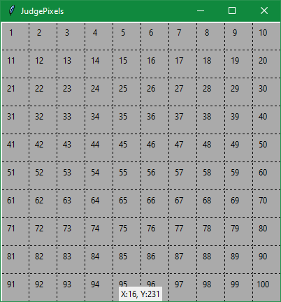

# JudgePixels
A tool that makes GUI development in Python (Tkinter) easier.

The tool creates window based on given window coordinates, and grid size (in pixels).

In the botoom, It shows position of the mouse cursor when it hovers over the window. This makes it easier to determine the pixel and location of the widget while placing in the window. This tool proves to be very useful when using place geometry manager in Tkinter.
